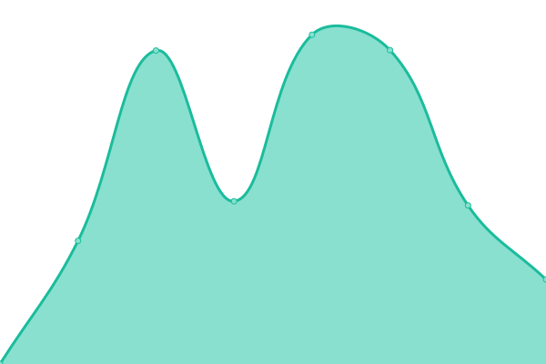
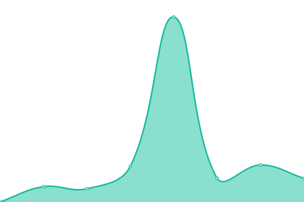

# [📈 Live Status](https://projects.datameet.org/upptime/): <!--live status--> **🟧 Partial outage**

This repository contains the open-source uptime monitor and status page for [Upptime](https://upptime.js.org), powered by [Upptime](https://github.com/upptime/upptime).

With [Upptime](https://upptime.js.org), you can get your own unlimited and free uptime monitor and status page, powered entirely by a GitHub repository. We use [Issues](https://github.com/upptime/upptime/issues) as incident reports, [Actions](https://github.com/datameet/upptime/actions) as uptime monitors, and [Pages](https://upptime.github.io/upptime) for the status page.

<!--start: status pages-->
<!-- This summary is generated by Upptime (https://github.com/upptime/upptime) -->
<!-- Do not edit this manually, your changes will be overwritten -->
<!-- prettier-ignore -->
| URL | Status | History | Response Time | Uptime |
| --- | ------ | ------- | ------------- | ------ |
|  [DataMeet](http://datameet.org/) | 🟩 Up | [data-meet.yml](https://github.com/datameet/upptime/commits/HEAD/history/data-meet.yml) | 

 1090ms
     
 | 

<a href="https://projects.datameet.org/upptime/history/data-meet">100.00%</a>
    

|  [Aadhaar Login](https://ssup.uidai.gov.in/ssup/login.html) | 🟩 Up | [aadhaar-login.yml](https://github.com/datameet/upptime/commits/HEAD/history/aadhaar-login.yml) | 

 2431ms
     
 | 

<a href="https://projects.datameet.org/upptime/history/aadhaar-login">58.43%</a>
    

|  [Passport User Registration Page](https://portal2.passportindia.gov.in/AppOnlineProject/user/RegistrationBaseAction?request_locale=en) | 🟩 Up | [passport-user-registration-page.yml](https://github.com/datameet/upptime/commits/HEAD/history/passport-user-registration-page.yml) | 

 2924ms
     
 | 

<a href="https://projects.datameet.org/upptime/history/passport-user-registration-page">100.00%</a>
    

|  [GST Login Page](https://services.gst.gov.in/services/login) | 🟥 Down | [gst-login-page.yml](https://github.com/datameet/upptime/commits/HEAD/history/gst-login-page.yml) | 

 1646ms
     
 | 

<a href="https://projects.datameet.org/upptime/history/gst-login-page">0.00%</a>
    

|  [Karnataka State Natural Disaster Management Centre](http://www.ksndmc.org/) | 🟥 Down | [karnataka-state-natural-disaster-management-centre.yml](https://github.com/datameet/upptime/commits/HEAD/history/karnataka-state-natural-disaster-management-centre.yml) | 

 0ms
     
 | 

<a href="https://projects.datameet.org/upptime/history/karnataka-state-natural-disaster-management-centre">0.00%</a>
    

|  [Co-WIN Self Registration](https://selfregistration.cowin.gov.in/) | 🟥 Down | [co-win-self-registration.yml](https://github.com/datameet/upptime/commits/HEAD/history/co-win-self-registration.yml) | 

 600ms
     
 | 

<a href="https://projects.datameet.org/upptime/history/co-win-self-registration">0.00%</a>
    

<!--end: status pages-->

[**Visit our status website →**](https://projects.datameet.org/upptime/)

## 📄 License

- Powered by: [Upptime](https://github.com/upptime/upptime)
- Code: [MIT](./LICENSE) © [Upptime](https://upptime.js.org)
- Data in the `./history` directory: [Open Database License](https://opendatacommons.org/licenses/odbl/1-0/)
